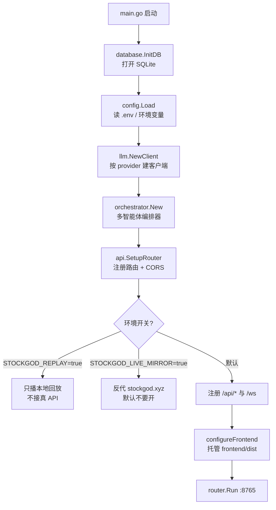
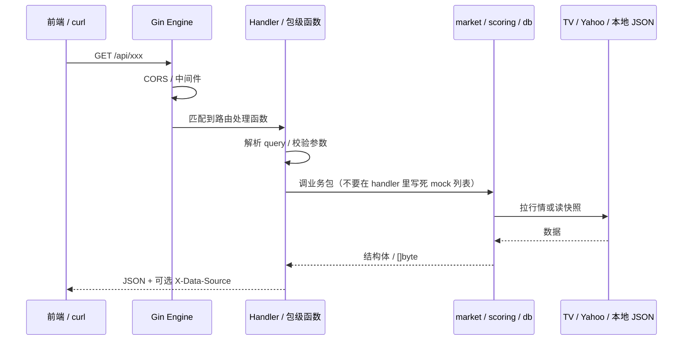
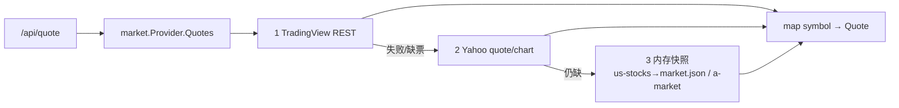
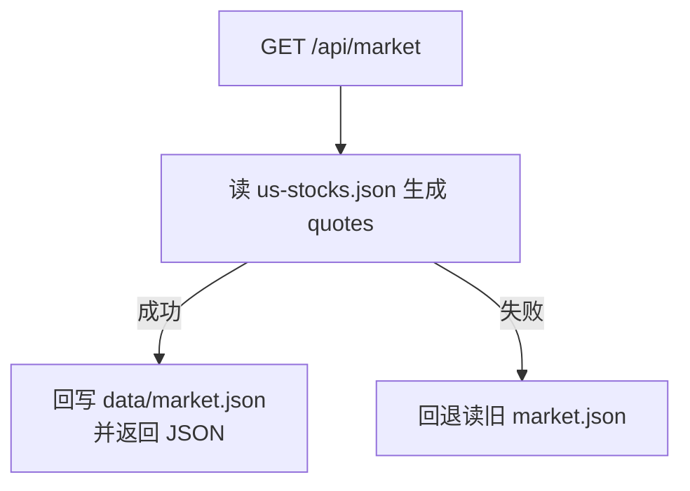
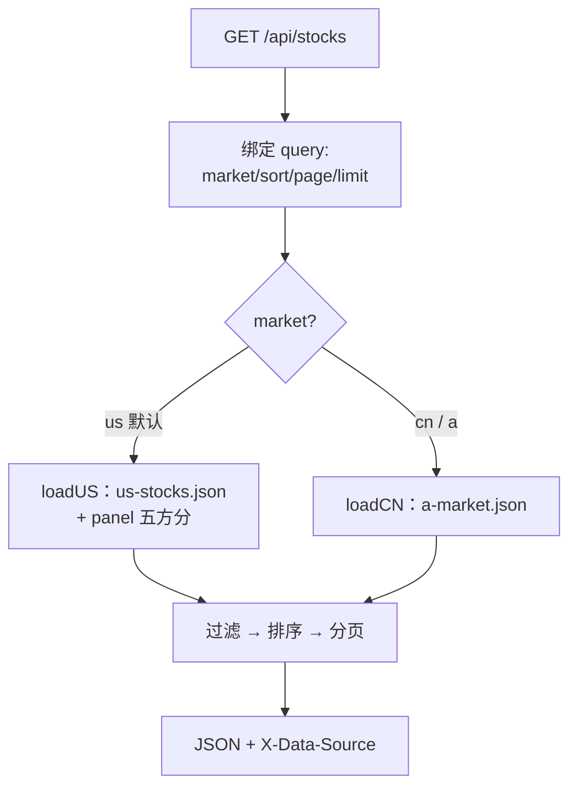
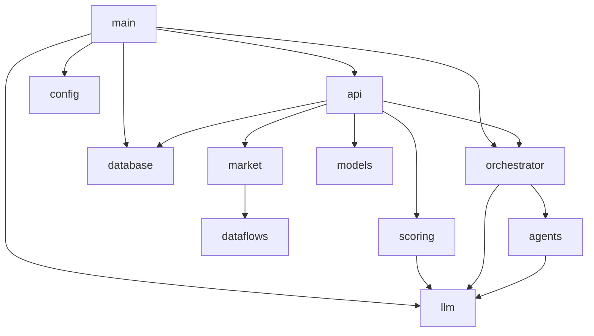

# Go 后端导读（给还不太熟 Go 的同学）

配合源码看：`app/backend/`。本文用流程图说明「请求从哪进、数据从哪来」。

---

## 1. 目录在干什么（先建立地图）

```
app/backend/
├── main.go                 # 程序入口：组装依赖 → 启动 HTTP
├── internal/
│   ├── api/                # HTTP 层（Gin handler，尽量薄）
│   ├── market/             # 实时/快照报价聚合
│   ├── dataflows/          # 外部客户端（TV、Yahoo…）
│   ├── scoring/            # 五方分 panel
│   ├── orchestrator/       # 多智能体分析编排
│   ├── llm/                # Gemini / DeepSeek 等
│   ├── database/           # SQLite、EDGAR/whales 同步
│   ├── agents/             # 各分析师角色
│   ├── config/             # 读 .env
│   └── models/             # 请求/响应结构体
├── data/                   # 本地 JSON 快照（macro、a-market…）
└── cmd/genscores|regenmarket  # 离线工具，不是 Web 服务主路径
```

Go 小知识：

- `package main` + `func main()` = 可执行程序入口。
- `internal/` = **只允许本模块引用**（外部项目 import 不了），用来保护实现细节。
- `c *gin.Context` = 一次 HTTP 请求的上下文（读 query、写 JSON）。

---

## 2. 启动流程



默认模式：自建 API + 可选托管前端静态文件。

---

## 3. 一次 HTTP 请求怎么走



记忆口诀：**Router 指路 → Handler 接线 → internal 干活 → JSON 回去**。

---

## 4. 行情链路（最重要）

### 4.1 `/api/quote?syms=RKLB,NVDA`（实时）



`Quote` 字段：`price` / `pct` / `prevClose` / `source`（便于排查用的是哪一路）。

### 4.2 `/api/market`（美股宇宙快照）



与 `/api/stocks?market=us` **同源**，避免「列表新、market 旧」。

### 4.3 `/api/stocks`



缓存：进程内约 **60 秒**（`stocksCacheTTL`），减少反复解析大 JSON。

---

## 5. 包关系（依赖方向）



原则：

- **上层可以依赖下层**（`api` → `market`）
- **下层不要反过来 import `api`**（避免循环依赖）

---

## 6. 两条产品线在后端怎么分

| 前端产品 | 典型 API |
|---|---|
| StockGod UX | `/api/stocks` `/api/quote` `/api/market` `/api/reports` `/api/whales/*` `/api/notes/*` |
| 驾驶舱 | `/api/analysis/*` `/api/trades` `/api/events` `/ws` |

同一 Gin 进程，**按路由分组**，不是两个服务。

---

## 7. 建议你怎么读源码（顺序）

1. `main.go` — 启动拼装（已加中文注释）
2. `internal/api/router.go` — 路由表（已加分区注释）
3. `internal/api/mock_handlers.go` — `/api/quote` `/api/market` 入口
4. `internal/market/provider.go` — 三层降级
5. `internal/api/stocks_handlers.go` — 列表 + cn/us
6. 需要分析功能时再看 `orchestrator` + `agents`

---

## 8. 本地跑起来

```bash
cd app/backend
go test ./internal/market/ ./internal/api/
go build -o /tmp/tradingagents-backend .
STOCKGOD_LOCAL_FRONTEND=true STOCKGOD_REPLAY=false /tmp/tradingagents-backend
```

抽检：

```bash
curl -s 'http://127.0.0.1:8765/api/quote?syms=RKLB' | python3 -m json.tool
curl -sI 'http://127.0.0.1:8765/api/market' | grep -i x-data-source
```

更多验收见 [TESTING.md](./TESTING.md)。
