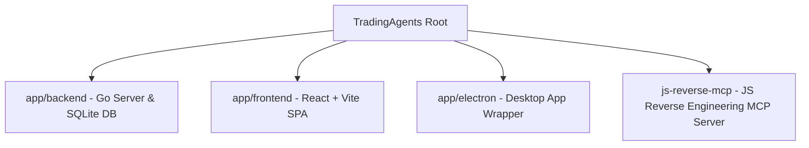

# AI Developer Guide - TradingAgents Project Architecture & Specifications

This document is designed for AI coding assistants to quickly and accurately understand the project layout, technical stack, customization rules, styling paradigms, and database structure.

---

## 1. Project Directory Structure

The project is structured into three main sub-projects and one helper tool:



### 📂 `app/backend` (Go Language)
- **Role**: Serves as the database coordinator, simulated exchange engine, and orchestrator of LLM-powered agents.
- **Entry point**: [main.go](file:///Applications/workspace/ai管力/账本/TradingAgents/app/backend/main.go) running a REST API server.
- **Key Modules**:
  - `internal/agents/`: Implements the multi-agent debate and evaluation graph (Technical, Fundamental, News, Sentiment analysts; Bull/Bear researchers; Trader; Portfolio Manager).
    - [analysts.go](file:///Applications/workspace/ai管力/账本/TradingAgents/app/backend/internal/agents/analysts.go): Core analysts generator functions and the global `languageInstruction(state)` helper.
    - [risk_mgmt.go](file:///Applications/workspace/ai管力/账本/TradingAgents/app/backend/internal/agents/risk_mgmt.go): Debate framework and Portfolio Manager logic.
  - `internal/api/`: Implements REST router and handlers.
    - [router.go](file:///Applications/workspace/ai管力/账本/TradingAgents/app/backend/internal/api/router.go): Defines paths for trade logs, macro events, and whale stock holdings.
- **Database**: SQLite database file located at `app/backend/trades.db`.

### 📂 `app/frontend` (React, TypeScript, Vite)
- **Role**: Single Page Application (SPA) displaying simulated cockpit dashboards, active trading metrics, whale flows, and news reports.
- **Key Pages**:
  - [Dashboard.tsx](file:///Applications/workspace/ai管力/账本/TradingAgents/app/frontend/src/pages/Dashboard.tsx): Simulated trade evaluation panel.
  - [MarketBoard.tsx](file:///Applications/workspace/ai管力/账本/TradingAgents/app/frontend/src/pages/MarketBoard.tsx): Shows real synced institutional holdings and congressional trades.
  - [Journal.tsx](file:///Applications/workspace/ai管力/账本/TradingAgents/app/frontend/src/pages/Journal.tsx): Trading journal logs and account performance analytics.
  - [Macro.tsx](file:///Applications/workspace/ai管力/账本/TradingAgents/app/frontend/src/pages/Macro.tsx): Macroeconomic calendar alerts.
- **State Stores (Zustand)**:
  - `useCommandStore`: Interacts with backend `/api/trades` and `/api/events`.
  - `useWhalesStore`: Interacts with backend `/api/whales` (returns gurugroup/congress trades).

### 📂 `app/electron` (Desktop App Wrapper)
- **Role**: Wraps the React SPA into a desktop window and launches the Go backend binary as a background resource.
- **Entry point**: [main.js](file:///Applications/workspace/ai管力/账本/TradingAgents/app/electron/main.js).
- **Asset sync**: Builds the React frontend and copies Vite's output into the local `app/electron/dist/` directory. Loads files relative to `dist/index.html`.
- **Packaging**: Packs the mac App as `TradingAgents-1.0.0-arm64.dmg` using `electron-builder`.

### 📂 `js-reverse-mcp` (Node MCP Server)
- **Role**: Model Context Protocol (MCP) server for JS reverse-engineering and anti-detection crawling.
- **Node 20 Compatibility**: Due to the local node environment being v20.20.2, the scripts use native ESM JavaScript launchers ([prepare.js](file:///Applications/workspace/ai管力/账本/TradingAgents/js-reverse-mcp/scripts/prepare.js) and [post-build.js](file:///Applications/workspace/ai管力/账本/TradingAgents/js-reverse-mcp/scripts/post-build.js)) rather than Node 22's `--experimental-strip-types` option.

---

## 2. Key Developer Specifications & Constraints

### 🌐 Bilingual Report Mandate
All LLM generated reports (News, Technical, Fundamentals, Trader, Portfolio Manager decisions) **must** generate bilingual text strictly structured as:
1. **English section** at the top.
2. A single markdown horizontal line divider (`---`).
3. **Chinese section** (简体中文) at the bottom.

This format is governed by the `languageInstruction` helper inside [analysts.go](file:///Applications/workspace/ai管力/账本/TradingAgents/app/backend/internal/agents/analysts.go). Do not modify this behaviour unless explicitly requested by the user.

### 🎨 Visual Theme System (stockgod.xyz/whales)
The frontend uses Vanilla CSS variable configurations in [index.css](file:///Applications/workspace/ai管力/账本/TradingAgents/app/frontend/src/index.css). It must strictly align with the style palette of `stockgod.xyz/whales`:
- **Base Background**: Deep space/ocean dark blue (`--bg-darker: #050814;`, `--bg-dark: #0a1122;`).
- **Cards & Panels**: Glassmorphism semi-transparency with backdrop filters (`--bg-card: rgba(13, 22, 46, 0.65);` with `backdrop-filter: blur(8px);`).
- **Accents**: Warm primary orange (`--color-primary: #f97316;`, `--color-primary-hover: #ea580c;`).
- **Hover Borders & Glows**: Subtle orange shadows (`--border-glow` and `--shadow-glow` using `#f97316`).

---

## 3. Database Schema & API Routing

The SQLite database (`trades.db`) exposes the following tables:
- **`trades`**: Stores historical simulated transactions logs (entry prices, quantities, tickers, types, profits).
- **`events`**: Stores economic calendar macro indicators (impact levels, warnings, timelines).
- **`gurus`**: Syncs real investment holdings (13F filings).
- **`congress_trades`**: Syncs real US congressional trading records.

### REST Endpoints:
- `GET /api/trades` | `POST /api/trades` | `DELETE /api/trades`
- `GET /api/stats` (Win rates, win counts, cumulative gains)
- `GET /api/events` | `POST /api/events` | `DELETE /api/events`
- `GET /api/whales` (Returns guru portfolios and politician records)

---

## 4. Common Commands & Run Guide

### Build the MCP Server
```bash
cd js-reverse-mcp
npm install
npm run build
```

### Compile the Backend Go Binary (for Electron extraResources)
```bash
cd app/backend
go build -o main main.go
```

### Run Frontend Dev Server
```bash
cd app/frontend
npm install
npm run dev
```

### Pack Electron application (producing DMG)
```bash
cd app/electron
npm install
npm run package
```
